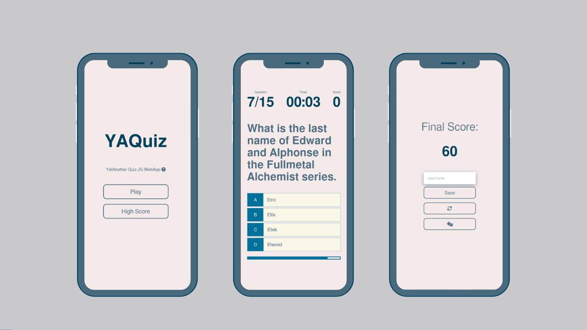

# YAQuiz - YetAnotherQuiz-JS-Webapp 

As the name suggests, YAQuiz is yet another basic `JavaScript` webapp working as a wrapper for [OpenTriviaDB](https://opentdb.com/). This is the first of many YA-YetAnother app to come. 

## Motivation 
With the rapid growth of web and web based technologies, I started to think how important it has become to know about web-dev. And that is precisely why I started to learn about the web. I believe that learning through doing is greater than learning by consuming media or reading. Hence this webapp is the amalgamation of my knowledge about the web.
> Huge shout-out to [James Q Quick](https://github.com/jamesqquick) from whom this app is heavily inspired and who taught to build from scratch. You can find his original work [here](https://github.com/jamesqquick/Build-A-Quiz-App-With-HTML-CSS-and-JavaScript)

## Behind the Scene
For the front-end structure and styling, `HTML` & `CSS` is used and back-end is handled by vanilla `JavaScript`. Data is fetched using `fetch` API from [OpenTriviaDB](https://opentdb.com/). 

## Todo
- [ ] Add transition animation
- [ ] Make it more responsive, remove unnecessary delays
- [ ] Add more styling to improve UI/UX
- [ ] Deploy